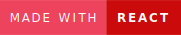

# Create a Real Estate Rental Application with React

  

_Project #7: Web Developer Training [OpenClassrooms](https://openclassrooms.com/en/paths/717-web-developer)_

   

[Kasa](https://hileene.github.io/BehalalAline_P7_Kasa/) - <a href="#version-française">README FR</a>

---

## Table of Contents

- [Project Description](#project-description)
- [Technologies](#technologies)
- [Fictional Scenario](#fictional-scenario)
- [Assessed Skills](#assessed-skills)
- [Technical Requirements](#technical-requirements)
- [Functional Requirements](#functional-requirements)
- [Installation](#installation)
- [Built With](#built-with)
- [Author](#author)

## Project Description

For this React project, my mission was to develop the entire application, React components, React Router routes, following Figma mockups, and all in a responsive manner.

## Technologies

- React
- JavaScript
- CSS

## Fictional Scenario

Kasa hires me as a freelance front-end developer to develop its new web platform. Kasa specializes in the private rental of apartments and is one of the leaders in its field in France. Its website was coded over 10 years ago in ASP.NET with significant legacy code.

Laura, the CTO, has initiated a complete overhaul to switch to a full JavaScript stack with
NodeJS on the back-end, and React on the front-end. As the back-end developer recruitment is not yet complete, the Front will be built from data in a JSON file.

## Assessed Skills

- 🌐 Configure navigation between application pages with React Router
- 🚀 Initialize an application with Create React App
- 👨‍💻 Develop elements of a website's interface using React components

## Technical Requirements

- For scrolling through photos in the gallery (Gallery component):

  - If the user is on the first image and clicks "Previous Image," the gallery displays the last image.
  - In contrast, when the displayed image is the last one in the gallery, clicking 'Next Image' by the user will result in the gallery displaying the first image.
  - If there is only one image, the "Next" and "Previous" buttons do not appear.

- The gallery must always remain the same height as indicated in the Figma mockup. The images will be cropped and centered within the image frame.

- Collapse: By default, Collapses are closed when the page initializes.

- If the Collapse is open, the user's click should close it.

  - On the other hand, when the Collapse is closed, a click should open it.

## Functional Requirements

- **React:**

  - Modular and reusable component breakdown;
  - One component per file;
  - Logical structure of different files;
  - Use of props between components;
  - Use of state in components when necessary;
  - Event handling;
  - Lists: React allows for interesting things with lists, iterating through them, for example with map. They should be used as much as possible.

- **React Router:**
  - Route parameters are managed by React Router in the URL to retrieve information for each property.
  - There is one page per route.
  - The 404 page is returned for each nonexistent route or if a value in the URL is not part of the provided data.
  - Router logic is consolidated in a single file.

## Installation

- This project was bootstrapped with [Create React App](https://github.com/facebook/create-react-app).

- In the project directory, you can run:`npm start`

- Open [http://localhost:3000](http://localhost:3000) to view it in your browser.

- The page will reload when you make changes. You may also see any lint errors in the console.

## Built With

- [Visual Studio Code](https://code.visualstudio.com/)
- [React](https://legacy.reactjs.org)
- [Figma](https://www.figma.com/)
- [GitHub](https://github.com/)
- [GitHub Pages](https://pages.github.com/)

## Author

- [@hileene](https://www.github.com/Hileene)
- [**Portfolio**](https://portfolio-test.com)

---

## VERSION FRANÇAISE

## Créez une application de location immobilière avec React

_Projet #7 : Formation Développeur Web [OpenClassrooms](https://openclassrooms.com/fr/paths/717-developpeur-web)_

## Sommaire

- [Description du Projet](#description-du-projet)
- [Technologies](#technologies)
- [Scénario Fictif](#scénario-fictif)
- [Compétences Évaluées](#compétences-évaluées)
- [Contraintes Techniques](#contraintes-techniques)
- [Contraintes Fonctionnelles](#contraintes-fonctionnelles)
- [Installation](#installation)
- [Développé Avec](#développé-avec)
- [Auteur](#auteur)

## Description du Projet

Pour ce projet React, ma mission était de développer l’ensemble de l’application, les composants React, les routes React Router, en suivant les maquettes Figma et le tout en responsive.

## Technologies

- React
- JavaScript
- CSS

## Scénario Fictif

Kasa me recrute en tant que développeur front-end en freelance pour développer sa nouvelle plateforme web. Kasa est dans le métier de la location d’appartements entre particuliers et fait partie des leaders dans son domaine en France. Son site a été codé il y a maintenant plus de 10 ans en ASP.NET avec un code legacy important.

Laura, la CTO, a donc lancé une refonte totale pour passer à une stack complète en JavaScript avec
NodeJS côté back-end, et React côté front-end. Le recrutement du développeur back-end n'étant pas terminé donc le Front sera construit à partir des données d'un fichier JSON.

## Compétences Évaluées

- 🌐 Configurer la navigation entre les pages de l'application avec React Router
- 🚀 Initialiser une application avec Create React App
- 👨‍💻 Développer des éléments de l'interface d'un site web grâce à des composants React

## Contraintes Techniques

- Pour le défilement des photos dans la galerie (composant Gallery) :

  - Si l'utilisateur se trouve à la première image et qu'il clique sur "Image précédente", la galerie affiche la dernière image.
  - Inversement, quand l'image affichée est la dernière de la galerie, si l'utilisateur clique sur "Image suivante", la galerie affiche la première image.
  - S'il n'y a qu'une seule image, les boutons "Suivant" et "Précédent" n'apparaissent pas.

- La galerie doit toujours rester de la même hauteur, celle indiquée sur la maquette Figma. Les images seront donc coupées et centrées dans le cadre de l’image.

- Collapse : Par défaut, les Collapses sont fermés à l'initialisation de la page.

- Si le Collapse est ouvert, le clic de l'utilisateur permet de le fermer.

  - Inversement, si le Collapse est fermé, un clic permet de l'ouvrir.

## Contraintes Fonctionnelles

- **React:**

  - Découpage en composants modulaires et réutilisables ;
  - Un composant par fichier ;
  - Structure logique des différents fichiers ;
  - Utilisation des props entre les composants ;
  - Utilisation du state dans les composants quand c'est nécessaire ;
  - Gestion des événements ;
  - Listes : React permet de faire des choses vraiment intéressantes avec les listes, en itérant dessus, par exemple avec map. Il faut les utiliser autant que possible.

- **React Router:**
  - Les paramètres des routes sont gérés par React Router dans l'URL pour récupérer les informations de chaque logement.
  - Il existe une page par route.
  - La page 404 est renvoyée pour chaque route inexistante, ou si une valeur présente dans l’URL ne fait pas partie des données renseignées.
  - La logique du routeur est réunie dans un seul fichier.

## Installation

- Ce projet a été initialisé avec [Create React App](https://github.com/facebook/create-react-app).

- Dans le répertoire du projet, vous pouvez exécuter : `npm start`

- Ouvrez [http://localhost:3000](http://localhost:3000) dans votre navigateur pour le visualiser.

- La page se rechargera automatiquement lorsque vous apportez des modifications. Vous pouvez également voir les erreurs de lint dans la console.

## Développé Avec

- [Visual Studio Code](https://code.visualstudio.com/)
- [React](https://legacy.reactjs.org)
- [Figma](https://www.figma.com/)
- [GitHub](https://github.com/)
- [GitHub Pages](https://pages.github.com/)

## Auteur

- [@hileene](https://www.github.com/Hileene)
- [**Portfolio**](https://portfolio-test.com)
